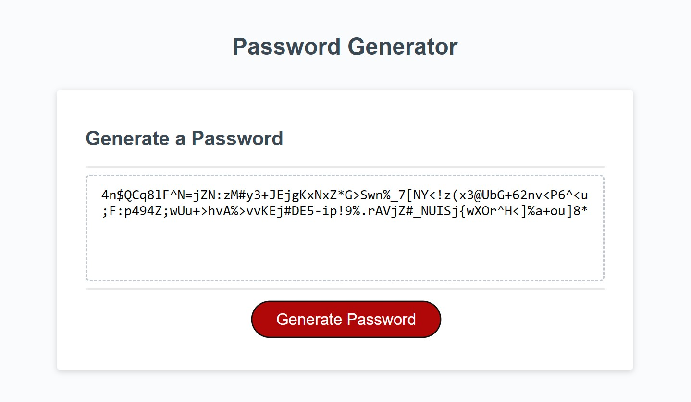

# Password_Generator

## Description
The Password Generator application is designed for individuals who tend to reuse the same passwords repeatedly. This tool allows users to generate unique and secure passwords by specifying the desired length and selecting from various character types. For instance, with a password length of eight characters and using all character types, it is theoretically possible to generate approximately 7.96 trillion unique passwords.
___
## Features
- Allows users to choose a password length ranging from 8 to 128 characters.
Provides options for including uppercase letters, lowercase letters, special characters, and numbers.
- Generates passwords with a combination of selected character types to enhance security.

___
## Preview

___
### Credit
The Staff at Bootcamp Spot for creating the HTML, CSS and, starting the JavaScript.   
[Rafael Gomez](https://github.com/Fallen-Master) made additional changes to the exsiting JavaScript.
___
### License
This project is licensed under the [MIT License](LICENSE).